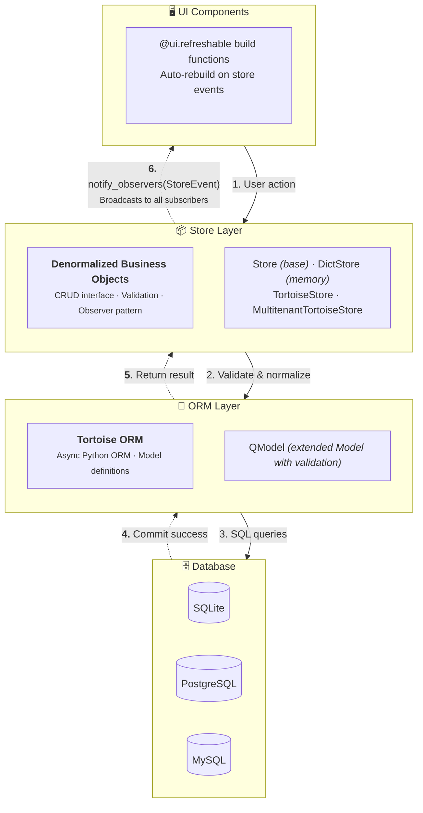

# nicegui-rdm

Reactive Data(base) Management for NiceGUI

## Overview

This project is based on two main ideas:

1. The importance of **reactivity to database applications**: data mutations should be reflected in UI components, *without* the user having to refresh a page. Imagine a typical table showing items, counts, stock being updated in near real-time as data is changing.<br>

2. NiceGUI architecture allows us to build composite **&ldquo;macro-level&rdquo; UI components** such as tables, dialogs, cards etc. with elegant, simple HTML elements and move the &lsquo;composite&rsquo; behavior to the server &mdash; and to Python. We can sidestep the Quasar garbage produced by ui.table, ui.dialog, etc.

The first idea is implemented in the **Store layer**, which performs coarse-grained state management for persistent &lsquo;back-end&rsquo; data, notifying registered observers of changes. It also maps non-normalized business objects to the ORM/database layer, performing validation, (de)hydration and provides computed fields.

We use Tortoise as our async ORM to drive the database, adding a thin **Model layer** that describes our data.

The second idea is implemented in a handful of reactive **components** — tables, dialogs, forms that act as observers of the Store layer. Their `build` method is called to refresh, whenever data relevant to that component changes. For those wanting to create other 


- **Model Helpers** — Validation, field specs, and extended Tortoise ORM base class
- **Multi-tenancy** — Built-in tenant scoping for SaaS applications

## Installation

```bash
pip install nicegui-rdm
```

## Quick Start

```python
from nicegui import ui
from ng_rdm import DictStore, FieldSpec, Validator
from ng_rdm.components import rdm_init, DataTable, Column, TableConfig

# Define validation
name_validator = Validator(
    message="Name cannot be empty",
    validator=lambda v, _: bool(v.strip()) if v else False
)

# Create a store with field specs
store = DictStore({'name': FieldSpec(validators=[name_validator])})

@ui.page('/')
async def main():
    rdm_init()  # Load styles and icons
    
    # Configure table
    config = TableConfig(
        table_columns=[Column('name', 'Name')],
        dialog_columns=[Column('name', 'Name', required=True)],
    )
    
    # Create reactive table - auto-refreshes on data changes
    table = DataTable({}, store, config)
    await table.build()

ui.run()
```

## Architecture



<!-- 
    %% Styling
    style UI fill:#e3f2fd,stroke:#1976d2,stroke-width:2px
    style STORE fill:#e8f5e9,stroke:#388e3c,stroke-width:2px
    style ORM fill:#fff3e0,stroke:#f57c00,stroke-width:2px
    style DB fill:#fce4ec,stroke:#c2185b,stroke-width:2px

  themeVariables:
    primaryColor: '#BB2528'
    primaryTextColor: '#fff'
    primaryBorderColor: '#7C0000'
    lineColor: '#F8B229'
    secondaryColor: '#006100'
    tertiaryColor: '#fff'

-->
**Data Flow:** User actions flow down through the Store layer (which validates and normalizes) to the database. On success, the Store broadcasts a `StoreEvent` to all subscribed UI components, which automatically rebuild via `@ui.refreshable`.

## Store Types

### DictStore

In-memory store for prototyping and testing:

```python
from ng_rdm import DictStore, FieldSpec, Validator

store = DictStore({
    'email': FieldSpec(validators=[
        Validator("Invalid email", lambda v, _: '@' in v if v else True)
    ])
})

await store.create_item({'name': 'Alice', 'email': 'alice@example.com'})
items = await store.read_items()
await store.update_item(1, {'name': 'Alice Smith'})
await store.delete_item({'id': 1})
```

### TortoiseStore

Database-backed store with Tortoise ORM:

```python
from ng_rdm import TortoiseStore, init_db
from tortoise import fields
from tortoise.models import Model

class Person(Model):
    id = fields.IntField(pk=True)
    name = fields.CharField(max_length=100)
    email = fields.CharField(max_length=100, null=True)

# Initialize database
await init_db('sqlite://:memory:', modules={'models': ['__main__']})

# Create store
store = TortoiseStore(model=Person)
```

### MultitenantTortoiseStore

Automatic tenant scoping for SaaS:

```python
from ng_rdm import MultitenantTortoiseStore

store = MultitenantTortoiseStore(
    model=Person,
    tenant_field='org_id'
)

# Set valid tenants for the current user
store.set_valid_tenants([1, 2, 3])
store.set_tenant(1)

# All queries now automatically filter by org_id=1
items = await store.read_items()
```

## Components

### DataTable

Primary editable table with configurable actions:

```python
from ng_rdm.components import DataTable, Column, TableConfig

config = TableConfig(
    table_columns=[
        Column('name', 'Name'),
        Column('email', 'Email'),
    ],
    dialog_columns=[
        Column('name', 'Name', required=True),
        Column('email', 'Email'),
    ],
)

table = DataTable({}, store, config)
await table.build()
```

### ListTable

Read-only table with clickable rows:

```python
from ng_rdm.components import ListTable

table = ListTable({}, store, config, on_click=lambda item: show_detail(item))
await table.build()
```

### ViewStack

List → Detail → Edit navigation:

```python
from ng_rdm.components import ViewStack

stack = ViewStack({}, store, config)
await stack.build()
```

## Observer Pattern

Stores notify observers on any change:

```python
from ng_rdm import StoreEvent

async def on_change(event: StoreEvent):
    print(f"{event.verb}: {event.item}")

store.add_observer(on_change)
```

## Validation

Define field validators and normalizers:

```python
from ng_rdm import FieldSpec, Validator

field_specs = {
    'email': FieldSpec(
        validators=[
            Validator("Required", lambda v, _: bool(v)),
            Validator("Invalid email", lambda v, _: '@' in v),
        ],
        normalizer=lambda v: v.lower().strip()
    ),
    'age': FieldSpec(
        validators=[
            Validator("Must be positive", lambda v, _: v > 0 if v else True),
        ]
    )
}

store = DictStore(field_specs)
valid, error = store.validate({'email': 'test', 'age': -1})
# valid=False, error={'col_name': 'email', 'error_msg': 'Invalid email', ...}
```

## Requirements

- Python 3.12+
- NiceGUI >= 1.4.0
- Tortoise ORM >= 0.20.0
- pytz

## License

MIT