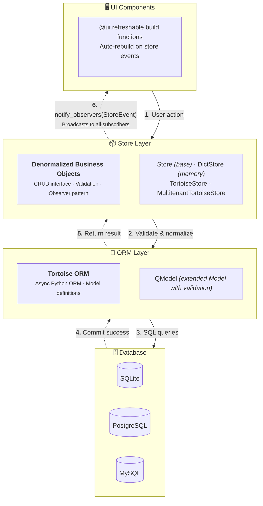

# nicegui-rdm

Reactive Data(base) Management for NiceGUI

## Overview

The objective of this project is to make it easier to build beautiful and responsive &lsquo;CRUD&rsquo; database applications with NiceGUI. 

It is based on two main ideas:

1. The importance of **reactivity to database applications**: data mutations should be reflected in UI components, *without* the user having to refresh a page. Imagine a typical table showing items, counts, stock being updated in near real-time as data is changing.<br><br>
This is implemented in the **Store layer**, which performs coarse-grained state management for persistent &lsquo;back-end&rsquo; data, notifying registered observers of any changes. Stores also map non-normalized business objects to the ORM/database layer, performing validation, (de)hydration and providing computed fields. While the store performs a type of state management, it is separate from (and possibly complementary to) the typical transient &lsquo;front-end&rsquo; user state - as managed by `ui.state` or `reaktiv`.<br><br> 
Below the Store layer, the async Tortoise ORM adds a thin **Model layer** that describes our data - and drives our database.

2. The second idea: NiceGUI architecture allows us to build composite **&ldquo;macro-level&rdquo; UI components** such as tables, dialogs, cards etc. using just elegant, simple HTML elements and move the &lsquo;composite&rsquo; behavior to the server &mdash; and to Python. This way, we can sidestep the Quasar garbage produced by ui.table, ui.dialog, etc.
<br><br>
This is implemented here in a handful of reactive **components** on top of (in fact: observers of) the Store layer. Their `build` member is called to refresh whenever data relevant to that component changes. The refresh typically recreates a large part of (or the entire) component - relying on local user state to reproduce it correctly.

## Installation

```bash
pip install nicegui-rdm
```

## Quick Start

```python
from nicegui import app, ui
from ng_rdm import TortoiseStore, init_db, store_registry, FieldSpec, Validator
from ng_rdm.models import QModel
from ng_rdm.components import rdm_init, DataTable, Column, TableConfig
from tortoise import fields

# Define your model
class Task(QModel):
    id = fields.IntField(pk=True)
    name = fields.CharField(max_length=100)
    
    field_specs = {
        'name': FieldSpec(validators=[
            Validator("Name cannot be empty", lambda v, _: bool(v.strip()) if v else False)
        ])
    }

# Initialize database at module level
init_db(app, 'sqlite://tasks.db', modules={'models': [__name__]}, generate_schemas=True)

@app.on_startup
async def startup():
    # Register stores as singletons at server startup
    # This ensures all browser sessions share the same store instance
    store_registry.register_store("default", "task", TortoiseStore(Task))

@ui.page('/')
async def main():
    rdm_init()  # Load styles and icons
    
    # Get singleton store from registry (same instance for all sessions)
    store = store_registry.get_store("default", "task")
    
    # Configure table
    config = TableConfig(
        columns=[Column('name', 'Name')],
    )
    
    # Create reactive table - auto-refreshes on data changes
    table = DataTable({}, store, config)
    await table.build()

ui.run()
```

See the `examples` directory for further inspiration, especially `components/showcase.py`.

## Architecture



<!-- 
    %% Styling
    style UI fill:#e3f2fd,stroke:#1976d2,stroke-width:2px
    style STORE fill:#e8f5e9,stroke:#388e3c,stroke-width:2px
    style ORM fill:#fff3e0,stroke:#f57c00,stroke-width:2px
    style DB fill:#fce4ec,stroke:#c2185b,stroke-width:2px

  themeVariables:
    primaryColor: '#BB2528'
    primaryTextColor: '#fff'
    primaryBorderColor: '#7C0000'
    lineColor: '#F8B229'
    secondaryColor: '#006100'
    tertiaryColor: '#fff'

-->
**Data Flow:** User actions flow down through the Store layer (which validates and normalizes) to the database. On success, the Store broadcasts a `StoreEvent` to all subscribed UI components, which automatically rebuild via `@ui.refreshable`.

## Store Types

Note that for reactivity to work, stores have to be instantiated as shared singletons per *store type* and (if you use a `MultitenantTortoiseStore`) per *tenant*. Only in that way can we make sure that mutations made by one store observer get forwarded to the other observes (within that tenant). See `ng_rdm.store.store_registry` for a generic helper.

### DictStore

In-memory store for prototyping and testing:

```python
from ng_rdm import DictStore, FieldSpec, Validator

store = DictStore({
    'email': FieldSpec(validators=[
        Validator("Invalid email", lambda v, _: '@' in v if v else True)
    ])
})

await store.create_item({'name': 'Alice', 'email': 'alice@example.com'})
items = await store.read_items()
await store.update_item(1, {'name': 'Alice Smith'})
await store.delete_item({'id': 1})
```

### TortoiseStore

Database-backed store with Tortoise ORM:

```python
from nicegui import app
from ng_rdm import TortoiseStore, init_db, store_registry
from ng_rdm.models import QModel
from tortoise import fields

class Person(QModel):
    id = fields.IntField(pk=True)
    name = fields.CharField(max_length=100)
    email = fields.CharField(max_length=100, null=True)

# Initialize database
init_db(app, 'sqlite://app.db', modules={'models': [__name__]}, generate_schemas=True)

@app.on_startup
async def startup():
    # Register as singleton for cross-session reactivity
    store_registry.register_store("default", "person", TortoiseStore(Person))

# In your page function, retrieve from registry:
# store = store_registry.get_store("default", "person")
```

### MultitenantTortoiseStore

Practically any app I make nowadays is multi-tenant SaaS, so if you need it we have automatic tenant scoping:

```python
from ng_rdm import MultitenantTortoiseStore, store_registry
from ng_rdm.store.multitenancy import set_valid_tenants

# Set valid tenants at startup
set_valid_tenants(["tenant_a", "tenant_b"])

@app.on_startup
async def startup():
    # Register one store per tenant for reactivity within each tenant
    for tenant in ["tenant_a", "tenant_b"]:
        store_registry.register_store(tenant, "person", MultitenantTortoiseStore(Person, tenant=tenant))

# In your page function, get the store for the current tenant:
# store = store_registry.get_store(current_tenant, "person")
# All queries automatically filter by the tenant field
```

## Components

### DataTable

Primary editable table with configurable actions:

```python
from ng_rdm.components import DataTable, Column, TableConfig

config = TableConfig(
    table_columns=[
        Column('name', 'Name'),
        Column('email', 'Email'),
    ],
    dialog_columns=[
        Column('name', 'Name', required=True),
        Column('email', 'Email'),
    ],
)

table = DataTable({}, store, config)
await table.build()
```

### ListTable

Read-only table with clickable rows:

```python
from ng_rdm.components import ListTable

table = ListTable({}, store, config, on_click=lambda item: show_detail(item))
await table.build()
```

### ViewStack

List → Detail → Edit navigation:

```python
from ng_rdm.components import ViewStack

stack = ViewStack({}, store, config)
await stack.build()
```

## Observer Pattern

Stores notify observers on any change:

```python
from ng_rdm import StoreEvent

async def on_change(event: StoreEvent):
    print(f"{event.verb}: {event.item}")

store.add_observer(on_change)
```

## Validation

Define field validators and normalizers:

```python
from ng_rdm import FieldSpec, Validator

field_specs = {
    'email': FieldSpec(
        validators=[
            Validator("Required", lambda v, _: bool(v)),
            Validator("Invalid email", lambda v, _: '@' in v),
        ],
        normalizer=lambda v: v.lower().strip()
    ),
    'age': FieldSpec(
        validators=[
            Validator("Must be positive", lambda v, _: v > 0 if v else True),
        ]
    )
}

store = DictStore(field_specs)
valid, error = store.validate({'email': 'test', 'age': -1})
# valid=False, error={'col_name': 'email', 'error_msg': 'Invalid email', ...}
```

## Requirements

- Python 3.12+
- NiceGUI >= 1.4.0
- Tortoise ORM >= 0.20.0
- pytz

## License

MIT